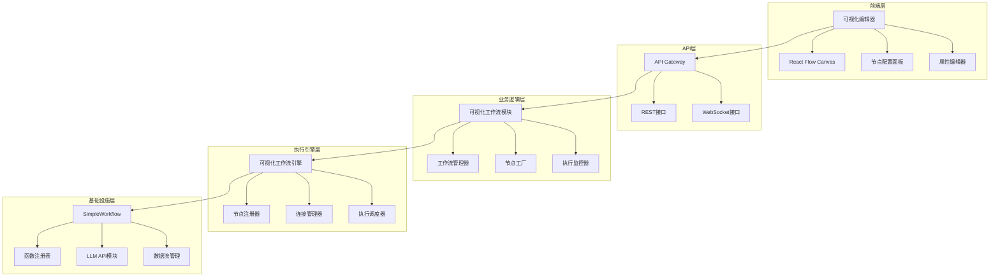
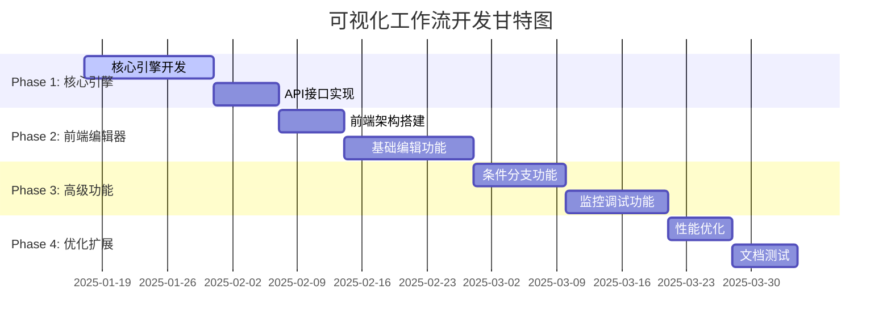

# 可视化工作流系统开发指南

> **版本：** v1.0  
> **最后更新：** 2025-01-17  
> **项目：** ModularFlow Framework - 可视化工作流引擎

## 📑 目录

- [1. 项目概述和目标](#1-项目概述和目标)
- [2. 完整架构设计](#2-完整架构设计)
- [3. 数据流机制设计](#3-数据流机制设计)
- [4. 前端可视化编辑器设计](#4-前端可视化编辑器设计)
- [5. 详细实现规范](#5-详细实现规范)
- [6. 兼容性分析](#6-兼容性分析)
- [7. 开发路线图](#7-开发路线图)
- [8. 技术栈和依赖清单](#8-技术栈和依赖清单)
- [9. 开发检查清单](#9-开发检查清单)

---

## 1. 项目概述和目标

### 🎯 项目愿景

创建一个便于使用的可视化工作流编排平台，支持多LLM协同工作，通过拖拽式界面让用户能够轻松构建复杂的LLM协同流程，实现高级的AI对话和处理能力。

### 核心目标

1. **可视化编排**: 提供直观的拖拽式界面，让用户无需编程即可创建复杂工作流
2. **多LLM协同**: 支持不同LLM提供商（OpenAI、Anthropic、Gemini）的协同工作
3. **条件分支**: 支持基于LLM输出的动态路径选择和条件执行
4. **代码块支持**: 允许插入自定义逻辑处理节点
5. **实时监控**: 提供工作流执行状态的实时可视化
6. **模板系统**: 提供预设的常用工作流模板

### 应用场景

- **智能对话系统**: 多轮对话中的意图识别和路径分发
- **内容处理**: 文档分析、摘要生成、多语言翻译
- **决策支持**: 基于多个AI模型的综合决策
- **批量处理**: 大规模数据的智能处理和分析

### 核心特性

- ✅ **零代码编排**: 拖拽式界面，无需编程技能
- ✅ **多提供商支持**: OpenAI、Anthropic、Gemini等
- ✅ **条件分支**: 基于AI输出的动态流程控制
- ✅ **实时执行**: 支持工作流的实时监控和调试
- ✅ **模板库**: 预设常用工作流模板
- ✅ **完全兼容**: 与现有ModularFlow Framework无缝集成

---

## 2. 完整架构设计

### 🏗️ 整体架构

#### 项目模块组织

基于ModularFlow框架的模块化设计原则：

```
ModularFlow-Framework/
├── modules/                          # 通用模块
│   ├── visual_workflow_module/       # 🆕 可视化工作流模块
│   │   ├── __init__.py
│   │   ├── visual_workflow_module.py # API接口
│   │   ├── workflow_engine.py        # 核心引擎
│   │   ├── node_types.py            # 节点定义
│   │   ├── workflow_manager.py      # 工作流管理
│   │   ├── execution_monitor.py     # 执行监控
│   │   └── README.md
│   │
│   ├── api_gateway_module/          # ✅ 现有API网关
│   ├── llm_api_module/             # ✅ 现有LLM API
│   └── web_server_module/          # ✅ 现有Web服务
│
├── orchestrators/                   # 工作流编排器
│   ├── simple_workflow.py         # ✅ 基础工作流
│   └── visual_workflow.py         # 🆕 可视化工作流引擎
│
├── frontend_projects/              # 前端项目
│   ├── visual_workflow_editor/     # 🆕 可视化编辑器
│   │   ├── package.json
│   │   ├── src/
│   │   │   ├── components/        # React组件
│   │   │   ├── services/          # API服务
│   │   │   └── utils/             # 工具函数
│   │   └── public/
│   │
│   └── SmartTavern/               # ✅ 现有项目
└── workflows/                     # 工作流存储
```

#### 系统架构层次



### 🔧 模块架构设计

#### 数据规范简化

采用面向LLM交互的简化数据类型：

```typescript
// 简化的数据类型
type WorkflowData = string | number | boolean | {
  text: string           // 主要内容 (LLM输入/输出)
  metadata?: any        // 可选元数据
}

// 节点输出标准
interface NodeOutput {
  text: string          // LLM的文本输出 (主要数据)
  signal?: number       // 控制信号 (条件分支用)
  confidence?: number   // 置信度 (可选)
  metadata?: any        // 元数据 (调试、日志等)
}
```

#### 节点类型定义

```python
class NodeType(Enum):
    INPUT = "input"                    # 输入节点
    LLM_CALL = "llm_call"             # LLM调用节点
    CODE_BLOCK = "code_block"         # 代码块节点
    CONDITION = "condition"           # 条件判断节点
    SWITCH = "switch"                 # 开关路由节点
    MERGER = "merger"                 # 结果聚合节点
    OUTPUT = "output"                 # 输出节点
```

#### 连接配置简化

```typescript
interface Connection {
  source: string
  target: string
  dataType: 'text' | 'signal' | 'all'    // 简化的数据类型
  condition?: string                       // 可选的条件表达式
}
```

---

## 3. 数据流机制设计

### 🔍 现有机制分析

#### SimpleWorkflow数据传递机制

基于[`SimpleWorkflow.execute()`](orchestrators/simple_workflow.py:145)的核心逻辑：

```python
# 数据传递核心机制
for conn in self.connections:
    if conn.to_func == func_name and conn.from_func in self.results:
        from_result = self.results[conn.from_func]
        if isinstance(from_result, dict) and conn.from_output in from_result:
            inputs[conn.to_input] = from_result[conn.from_output]
```

#### 现有机制特点

1. **字典键值传递**: 所有函数结果必须是dict，通过key访问特定值
2. **静态连接**: 连接关系在执行前确定，无法动态修改
3. **简单映射**: `FlowConnection`只支持1:1的字段映射
4. **同步执行**: 虽然有async版本，但条件分支逻辑是线性的

### 💡 增强型数据传递机制

#### 1. 增强连接定义

```python
@dataclass
class EnhancedFlowConnection:
    """增强型数据流连接"""
    from_func: str
    from_output: str
    to_func: str  
    to_input: str
    
    # 新增字段
    condition: Optional[str] = None      # 条件表达式
    transform: Optional[str] = None      # 数据转换逻辑
    data_selector: Optional[Dict] = None # 动态数据选择
```

#### 2. 条件执行引擎

```python
class ConditionalWorkflow(SimpleWorkflow):
    """支持条件分支的工作流引擎"""
    
    def __init__(self):
        super().__init__()
        self.conditional_connections = []  # 条件连接
        self.data_context = {}            # 全局数据上下文
    
    def add_condition_node(self, node_id: str, condition_logic: str):
        """添加条件判断节点"""
        def condition_func(**inputs):
            # 执行条件逻辑，返回分支选择
            return {"branch": eval_condition(condition_logic, inputs, self.data_context)}
        
        self.registry.register(node_id, condition_func, ['input'], ['branch'])
    
    def add_switch_connection(self, from_func: str, condition_map: Dict):
        """添加条件分支连接"""
        # condition_map: {branch_value: target_func}
        self.conditional_connections.append({
            'from_func': from_func,
            'condition_map': condition_map
        })
```

#### 3. 代码块节点实现

```python
def create_code_block_node(node_id: str, code: str, context_vars: Dict = None):
    """创建代码块节点"""
    
    def code_block_func(**inputs):
        # 创建执行环境
        exec_context = {
            'inputs': inputs,
            'context': context_vars or {},
            'utils': {  # 提供工具函数
                'select_data': lambda key, data_map: data_map.get(key),
                'format_prompt': lambda template, **kwargs: template.format(**kwargs)
            }
        }
        
        # 执行用户代码
        exec(code, exec_context)
        
        # 返回结果
        return exec_context.get('outputs', {})
    
    return code_block_func
```

### 🚀 具体应用示例

#### 多LLM判断与条件分支

```python
# 创建工作流
wf = ConditionalWorkflow("multi_llm_decision")

# 1. LLM-A: 判断节点
wf.add_llm_node("llm_judge", {
    "prompt": "根据输入文本判断应该调用哪种语料处理方式，返回1,2,3中的一个数字",
    "provider": "gemini"
})

# 2. 代码块: 动态语料选择
language_selector_code = """
judge_result = inputs['response']['content']
choice = int(judge_result.strip())

language_corpus = {
    1: "正式商务语料库",
    2: "日常对话语料库", 
    3: "技术文档语料库"
}

outputs = {
    'selected_corpus': language_corpus.get(choice, language_corpus[1]),
    'choice': choice
}
"""
wf.add_code_block("language_selector", language_selector_code)

# 3. Switch节点: 路径选择
wf.add_condition_node("path_switch", "inputs['choice']")

# 4. 不同的LLM处理节点
wf.add_llm_node("llm_formal", {"prompt": "使用正式语调处理: {corpus}", "provider": "openai"})
wf.add_llm_node("llm_casual", {"prompt": "使用日常语调处理: {corpus}", "provider": "anthropic"})

# 5. 建立连接
wf.connect("llm_judge", "language_selector", {"response": "response"})
wf.connect("language_selector", "path_switch", {"choice": "choice"})

# 6. 条件分支连接
wf.add_switch_connection("path_switch", {
    1: "llm_formal",
    2: "llm_casual", 
    3: ["llm_formal", "llm_casual"]  # 并行执行
})
```

### 📊 数据流追踪

```python
class DataFlowTracker:
    """数据流追踪器"""
    
    def __init__(self):
        self.flow_log = []
        
    def log_data_transfer(self, from_node, to_node, data, condition=None):
        self.flow_log.append({
            'timestamp': time.time(),
            'from': from_node,
            'to': to_node, 
            'data': data,
            'condition': condition
        })
    
    def get_flow_visualization(self):
        """生成数据流可视化"""
        return self.flow_log
```

---

## 4. 前端可视化编辑器设计

### 🎨 整体界面布局

```
┌─────────────────────────────────────────────────────────────────┐
│                        工作流编辑器                                │
├─────────┬─────────────────────────────────────┬─────────────────┤
│         │                                     │                 │
│ 节点面板  │              主画布区域                │   属性配置面板    │
│ (200px) │            (自适应)                  │    (300px)     │
│         │                                     │                 │
│ 📝 LLM  │  ┌─── 用户输入 ───┐                   │ ┌─ 节点配置 ─┐  │
│ 🔧 代码块 │  │              │                   │ │ 提供商:    │  │
│ ⚡ 条件  │  └──────┬───────┘                   │ │ [Gemini▼] │  │
│ 🎯 聚合  │         │                           │ │           │  │
│ 📤 输出  │         ▼                           │ │ 模型:     │  │
│         │  ┌─── LLM分析 ───┐                   │ │ [2.5-flash]│  │
│ + 自定义 │  │ 🤖 [Gemini]   │──┐                │ │           │  │
│         │  │ "判断用户意图" │  │                │ │ 提示词:   │  │
│         │  └───────────────┘  │                │ │ [编辑器]  │  │
│         │         │           │                │ └───────────┘  │
│         │         ▼           ▼                │                 │
│         │  ┌─── 条件分支 ───┐ ┌─── 情感分析 ───┐ │ ┌─ 执行状态 ─┐  │
│         │  │ ⚡ Switch     │ │ 🤖 [Claude]    │ │ │ ⏸️ 已暂停  │  │
│         │  │ signal → path │ │ "分析情感倾向"  │ │ │ 进度: 2/5  │  │
│         │  └───────────────┘ └───────────────┘ │ │ 运行时间:  │  │
│         │         │                           │ │ 00:01:23   │  │
│         │         ▼                           │ └───────────┘  │
│         │  ┌─── 结果聚合 ───┐                  │                 │
│         │  │ 🎯 Merge      │                  │ ┌─ 流程控制 ─┐  │
│         │  │ "整合分析结果" │                  │ │ ▶️ 执行    │  │
│         │  └───────────────┘                  │ │ ⏸️ 暂停    │  │
│         │         │                           │ │ 🔄 重置    │  │
│         │         ▼                           │ │ 💾 保存    │  │
│         │  ┌─── 最终输出 ───┐                  │ └───────────┘  │
│         │  │ 📤 Output     │                  │                 │
│         │  │ "显示给用户"   │                  │                 │
│         │  └───────────────┘                  │                 │
│         │                                     │                 │
├─────────┴─────────────────────────────────────┴─────────────────┤
│ 底部状态栏: 工作流: "用户意图分析" | 节点: 6 | 连接: 5 | 最后保存: 2分钟前 │
└─────────────────────────────────────────────────────────────────┘
```

### 🧩 节点设计规范

#### 节点视觉样式

```css
/* 基础节点样式 */
.workflow-node {
  width: 160px;
  min-height: 80px;
  border-radius: 8px;
  border: 2px solid #ddd;
  background: white;
  box-shadow: 0 2px 8px rgba(0,0,0,0.1);
  position: relative;
  cursor: move;
}

/* 节点类型样式 */
.node-llm { border-color: #4CAF50; }      /* 绿色 - LLM节点 */
.node-code { border-color: #FF9800; }     /* 橙色 - 代码块 */
.node-condition { border-color: #2196F3; } /* 蓝色 - 条件节点 */
.node-merge { border-color: #9C27B0; }    /* 紫色 - 聚合节点 */
.node-output { border-color: #607D8B; }   /* 灰色 - 输出节点 */

/* 执行状态 */
.node-running { border-color: #FFC107; animation: pulse 1s infinite; }
.node-completed { border-color: #4CAF50; }
.node-error { border-color: #F44336; }
```

#### LLM节点详细设计

```
┌────────────────────┐
│ 🤖 LLM调用         │ ← 节点标题
├────────────────────┤
│ Provider: Gemini   │ ← 关键配置显示
│ Model: 2.5-flash   │
├────────────────────┤
│ "判断用户输入的意图  │ ← 提示词预览
│ 分类为: 咨询、投诉、 │   (截断显示)
│ 建议..."           │
├────────────────────┤
│ ● text_in         │ ← 输入端口
│                 ●  │ ← 输出端口 text_out
│               ○    │ ← 输出端口 signal
└────────────────────┘
```

### 🔗 连接线设计

#### 连接线类型与状态

```typescript
interface ConnectionStyle {
  type: 'data' | 'control'
  
  // 数据连接 - 实线
  data: {
    color: '#666',
    width: 2,
    style: 'solid'
  }
  
  // 控制连接 - 虚线  
  control: {
    color: '#2196F3',
    width: 2,
    style: 'dashed'
  }
}
```

#### 连接状态可视化

```css
/* 连接线状态 */
.connection-normal { stroke: #666; }
.connection-active { stroke: #4CAF50; animation: flow 2s linear infinite; }
.connection-error { stroke: #F44336; }

/* 数据流动画 */
@keyframes flow {
  0% { stroke-dasharray: 5 5; stroke-dashoffset: 0; }
  100% { stroke-dashoffset: 10; }
}
```

### 🛠️ 节点配置界面

#### LLM节点配置

```typescript
interface LLMNodeConfigUI {
  sections: [
    {
      title: "基础配置",
      fields: [
        {
          label: "节点名称",
          type: "text",
          value: "LLM分析"
        },
        {
          label: "LLM提供商",
          type: "select", 
          options: ["OpenAI", "Anthropic", "Gemini"],
          value: "Gemini"
        },
        {
          label: "模型",
          type: "select",
          options: ["gpt-4", "claude-3", "gemini-2.5-flash"],
          value: "gemini-2.5-flash"
        }
      ]
    },
    {
      title: "提示词配置", 
      fields: [
        {
          label: "系统提示词",
          type: "textarea",
          placeholder: "设定AI的角色和行为..."
        },
        {
          label: "用户提示词",
          type: "code-editor",  // 支持变量高亮
          value: "请分析用户输入的意图: {{text_in}}\n\n分类为以下类型之一:\n1. 咨询\n2. 投诉\n3. 建议\n\n请返回对应的数字编号。",
          variables: ["text_in"]  // 可用变量提示
        }
      ]
    },
    {
      title: "高级参数",
      fields: [
        {
          label: "Temperature",
          type: "slider",
          min: 0,
          max: 1,
          step: 0.1,
          value: 0.7
        },
        {
          label: "Max Tokens",
          type: "number",
          value: 2048
        }
      ]
    }
  ]
}
```

#### 代码块节点配置

```typescript
interface CodeBlockConfigUI {
  tabs: [
    {
      label: "简单模式",
      content: {
        type: "expression-builder",
        examples: [
          "文本长度 > 100",
          "包含关键词('紧急')",
          "情感分数 < 0.3"
        ]
      }
    },
    {
      label: "代码模式", 
      content: {
        type: "code-editor",
        language: "python",
        template: `# 输入数据: inputs['text_in']
text = inputs['text_in']

# 处理逻辑
if '紧急' in text:
    output = {'signal': 1, 'priority': 'high'}
else:
    output = {'signal': 0, 'priority': 'normal'}

# 输出数据会传递给下一个节点`,
        intellisense: true  // 代码提示
      }
    }
  ]
}
```

### 🎮 交互流程设计

#### 创建工作流流程

```
1. 新建工作流
   ↓
2. 从节点面板拖拽"用户输入"节点到画布
   ↓ 
3. 拖拽"LLM调用"节点，自动吸附到"用户输入"节点下方
   ↓
4. 系统提示："是否连接这两个节点？" [是] [否]
   ↓ (选择[是])
5. 自动创建连接线，打开LLM节点配置面板
   ↓
6. 配置提示词、模型等，保存
   ↓
7. 继续添加条件分支节点...
```

### 🎯 用户体验增强

#### 智能提示功能

```typescript
interface SmartSuggestions {
  // 节点推荐
  nodeRecommendation: {
    trigger: "after_llm_node",
    suggestions: ["添加条件分支", "添加结果聚合", "添加输出节点"]
  }
  
  // 连接提示  
  connectionHint: {
    trigger: "hover_output_port",
    message: "拖拽到其他节点的输入端口来创建连接"
  }
  
  // 错误提示
  errorHint: {
    trigger: "invalid_connection", 
    message: "此连接类型不匹配，LLM输出应连接到文本输入端口"
  }
}
```

#### 工作流执行可视化

```typescript
interface ExecutionVisualization {
  // 节点状态指示
  nodeStatus: {
    waiting: "⏳",    // 等待执行
    running: "🔄",    // 正在执行  
    completed: "✅",  // 执行完成
    error: "❌"       // 执行错误
  }
  
  // 数据流动画
  dataFlow: {
    enabled: true,
    speed: "2s",      // 动画速度
    showData: true    // 显示传递的数据
  }
  
  // 执行日志 
  executionLog: {
    position: "bottom_panel",
    autoScroll: true,
    filters: ["info", "warning", "error"]
  }
}
```

---

## 5. 详细实现规范

### 📋 核心组件实现

#### 1. 可视化工作流引擎 (`orchestrators/visual_workflow.py`)

##### 主要类和数据结构

```python
# 节点类型枚举
class NodeType(Enum):
    INPUT = "input"                    # 输入节点
    LLM_CALL = "llm_call"             # LLM调用节点
    CODE_BLOCK = "code_block"         # 代码块节点
    CONDITION = "condition"           # 条件判断节点
    SWITCH = "switch"                 # 开关路由节点
    MERGER = "merger"                 # 结果聚合节点
    OUTPUT = "output"                 # 输出节点

# 节点数据类
@dataclass
class LLMNodeData:
    node_id: str
    provider: str = "gemini"
    model: str = "gemini-2.5-flash"
    prompt: str = ""
    system_prompt: str = ""
    temperature: float = 0.7
    max_tokens: int = 2048

@dataclass
class CodeBlockNodeData:
    node_id: str
    code_type: str = "python"  # python | javascript
    code: str = ""
    expression: str = ""       # 简单表达式模式

# 工作流定义
@dataclass
class WorkflowDefinition:
    id: str
    name: str
    description: str = ""
    nodes: List[WorkflowNode] = None
    edges: List[WorkflowEdge] = None
    metadata: Dict[str, Any] = None

# 主引擎类
class VisualWorkflow:
    def __init__(self, workflow_def: WorkflowDefinition = None)
    def load_from_definition(self, workflow_def: WorkflowDefinition)
    def _register_nodes(self)          # 注册所有节点为可执行函数
    def _setup_connections(self)       # 建立节点连接
    def execute(self, input_data: Dict) -> Dict  # 执行工作流
    def get_execution_state(self) -> Dict        # 获取执行状态
```

##### LLM节点实现

```python
def _register_llm_node(self, node: WorkflowNode):
    def llm_function(**inputs):
        # 构建消息
        input_text = inputs.get('input', '')
        
        # 应用提示词模板（支持{{变量}}替换）
        prompt = node.data['prompt'].replace('{{input}}', input_text)
        
        # 调用现有LLM API
        response = self.registry.call("api.call", 
                                    messages=[{"role": "user", "content": prompt}],
                                    provider=node.data['provider'],
                                    model=node.data['model'])
        
        # 返回标准化结果
        return {
            'text': response['response']['content'],
            'signal': self._extract_signal(response),
            'raw_response': response
        }
    
    # 注册到function_registry
    self.registry.register(f"visual_node_{node.id}", llm_function)
```

##### 代码块执行

```python
def _execute_python_code(self, code: str, inputs: Dict) -> Dict:
    # 构建安全执行环境
    safe_globals = {
        '__builtins__': {'len': len, 'str': str, 'int': int, ...},
        'inputs': inputs,
        'text': inputs.get('text', ''),
        're': __import__('re'),
        'json': __import__('json'),
    }
    
    local_scope = {'output': None}
    exec(code, safe_globals, local_scope)
    
    return local_scope.get('output', {})
```

##### 条件分支处理

```python
def _register_condition_node(self, node: WorkflowNode):
    def condition_function(**inputs):
        expression = node.data['condition_expression']
        context = {
            'signal': inputs.get('signal'),
            'text': inputs.get('text', ''),
            'length': len(str(inputs.get('text', ''))),
        }
        
        result = eval(expression, {"__builtins__": {}}, context)
        return {
            'condition_result': bool(result),
            'branch': 'true' if result else 'false'
        }
```

#### 2. 可视化工作流API模块 (`modules/visual_workflow_module/`)

##### 目录结构
```
modules/visual_workflow_module/
├── __init__.py
├── visual_workflow_module.py      # API接口函数
├── workflow_manager.py            # 工作流管理器
├── node_factory.py               # 节点工厂类
├── execution_monitor.py          # 执行监控
├── README.md
└── variables.py                   # 模块配置
```

##### API接口实现

```python
# modules/visual_workflow_module/visual_workflow_module.py

from core.function_registry import register_function
from core.services import get_current_globals
from orchestrators.visual_workflow import VisualWorkflow, WorkflowDefinition

@register_function(name="visual_workflow.create", outputs=["workflow_id"])
def create_workflow(name: str, description: str = ""):
    """创建新的可视化工作流"""
    workflow = create_visual_workflow(name)
    
    # 存储到全局状态
    g = get_current_globals()
    if not hasattr(g, 'visual_workflows'):
        g.visual_workflows = {}
    
    g.visual_workflows[workflow.workflow_def.id] = workflow
    
    return {"workflow_id": workflow.workflow_def.id}

@register_function(name="visual_workflow.add_node", outputs=["node_id", "success"])
def add_node(workflow_id: str, node_type: str, position: dict, config: dict):
    """添加节点到工作流"""
    g = get_current_globals()
    workflow = g.visual_workflows.get(workflow_id)
    
    if not workflow:
        return {"node_id": None, "success": False, "error": "工作流不存在"}
    
    # 创建节点...
    node = create_node(node_type, position, config)
    workflow.workflow_def.nodes.append(node)
    
    # 重新注册节点
    workflow._register_nodes()
    
    return {"node_id": node.id, "success": True}

@register_function(name="visual_workflow.execute", outputs=["execution_id", "result"])
def execute_workflow(workflow_id: str, inputs: dict = None):
    """执行工作流"""
    g = get_current_globals()
    workflow = g.visual_workflows.get(workflow_id)
    
    if not workflow:
        return {"execution_id": None, "result": {"success": False, "error": "工作流不存在"}}
    
    # 执行工作流
    result = workflow.execute(inputs or {})
    
    execution_id = str(uuid.uuid4())
    return {"execution_id": execution_id, "result": result}

@register_function(name="visual_workflow.list", outputs=["workflows"])
def list_workflows():
    """获取所有工作流"""
    g = get_current_globals()
    workflows = getattr(g, 'visual_workflows', {})
    
    workflow_list = []
    for workflow_id, workflow in workflows.items():
        workflow_list.append({
            "id": workflow_id,
            "name": workflow.workflow_def.name,
            "description": workflow.workflow_def.description,
            "node_count": len(workflow.workflow_def.nodes),
            "edge_count": len(workflow.workflow_def.edges)
        })
    
    return {"workflows": workflow_list}
```

### 🔧 技术实现要点

#### 1. 与现有系统集成

- **复用SimpleWorkflow**: 作为底层执行引擎
- **复用function_registry**: 注册可视化节点为标准函数
- **复用LLM API系统**: 调用现有的api.call接口
- **复用API网关**: 通过function_registry自动暴露REST API

#### 2. 数据格式简化

```python
# 简化的数据传递格式
NodeOutput = {
    'text': str,          # 主要文本内容
    'signal': int/None,   # 控制信号（用于条件分支）
    'metadata': dict      # 可选元数据
}
```

#### 3. 安全执行环境

```python
# 代码块安全执行环境
safe_globals = {
    '__builtins__': {
        'len': len, 'str': str, 'int': int, 'float': float,
        'dict': dict, 'list': list, 'min': min, 'max': max,
        'sum': sum, 'any': any, 'all': all
    },
    'inputs': inputs,
    're': __import__('re'),      # 正则表达式
    'json': __import__('json'),   # JSON处理
    'time': __import__('time'),   # 时间函数
}
```

#### 4. 错误处理机制

```python
# 节点执行错误处理
try:
    result = node_function(**inputs)
    return result
except Exception as e:
    return {
        'text': f"节点执行错误: {str(e)}",
        'signal': None,
        'error': str(e),
        'node_id': node.id
    }
```

---

## 6. 兼容性分析

### 📊 兼容性评估结果

✅ **完全兼容** - 可视化工作流系统设计与现有ModularFlow Framework架构完美契合！

### 🏗️ 架构集成分析

#### 1. 前端项目集成

基于[`web_server_module`](modules/web_server_module/README.md)的现有能力：

```json
// frontend_projects/frontend-projects.json 新增配置
{
  "projects": [
    {
      "name": "visual_workflow_editor",
      "display_name": "可视化工作流编辑器", 
      "type": "react",
      "path": "frontend_projects/visual_workflow_editor",
      "port": 3002,
      "api_endpoint": "http://localhost:6500/api/v1",
      "build_command": "npm run build",
      "dev_command": "npm start",
      "description": "多LLM协同的可视化工作流编排平台",
      "dependencies": {
        "react": "^18.0.0",
        "react-flow-renderer": "^10.0.0",
        "antd": "^5.0.0",
        "axios": "^1.0.0"
      },
      "enabled": true
    }
  ]
}
```

#### 2. 后端模块集成

**模块位置**: `modules/visual_workflow_module/`

```python
# modules/visual_workflow_module/__init__.py
from .visual_workflow_module import get_visual_workflow_manager

# modules/visual_workflow_module/visual_workflow_module.py
from core.function_registry import register_function
from core.services import get_current_globals

@register_function(name="visual_workflow.create", outputs=["workflow_id"])
def create_workflow(name: str, description: str = ""):
    """创建新的可视化工作流"""
    pass

@register_function(name="visual_workflow.execute", outputs=["execution_id"])  
def execute_workflow(workflow_id: str, inputs: dict = None):
    """执行可视化工作流"""
    pass
```

### 3. 与现有系统的完美契合

#### ✅ Web服务器模块兼容性
- **项目管理**: 可直接使用`web_server.start_project("visual_workflow_editor")`启动
- **开发环境**: 支持React热重载、自动浏览器打开
- **多端口管理**: 避免与现有SmartTavern(6601)等项目冲突

#### ✅ API网关集成
- **RESTful API**: 通过现有API网关(`localhost:6500/api/v1`)暴露接口
- **WebSocket支持**: 复用现有WebSocket系统实现实时监控
- **CORS处理**: 自动处理跨域请求

#### ✅ 函数注册系统
- **无缝集成**: 所有可视化工作流API都通过function_registry注册
- **自动发现**: API网关自动暴露注册的函数为REST端点
- **统一调用**: 前端可通过标准API格式调用后端功能

### 🚀 实际集成示例

#### 启动完整开发环境

```python
# 一键启动包含可视化编辑器的完整开发环境
from modules.web_server_module import get_web_server
from modules.api_gateway_module import get_api_gateway

# 1. 启动API网关（后端）
gateway = get_api_gateway()
gateway.start_server(background=True)

# 2. 启动SmartTavern（现有系统）
server = get_web_server() 
server.start_project("SmartTavern")  # http://localhost:6601

# 3. 启动可视化工作流编辑器（新的）
server.start_project("visual_workflow_editor")  # http://localhost:3002

print("🚀 完整开发环境已启动:")
print("📊 API文档: http://localhost:6500/docs")
print("💬 SmartTavern: http://localhost:6601") 
print("🎨 可视化编辑器: http://localhost:3002")
```

#### 前端API调用示例

```typescript
// frontend_projects/visual_workflow_editor/src/services/api.ts
import axios from 'axios';

const API_BASE = 'http://localhost:6500/api/v1';

export class VisualWorkflowAPI {
  // 创建工作流
  async createWorkflow(name: string, description?: string) {
    const response = await axios.post(`${API_BASE}/visual_workflow/create`, {
      name, description
    });
    return response.data;
  }
  
  // 执行工作流 
  async executeWorkflow(workflowId: string, inputs?: any) {
    const response = await axios.post(`${API_BASE}/visual_workflow/execute`, {
      workflow_id: workflowId, inputs
    });
    return response.data;
  }
  
  // WebSocket实时监控
  connectToExecution(executionId: string) {
    const ws = new WebSocket(`ws://localhost:6500/ws`);
    ws.send(JSON.stringify({
      type: 'subscribe',
      channel: `execution_${executionId}`
    }));
    return ws;
  }
}
```

### 📊 兼容性评分

| 组件 | 兼容性 | 复用度 | 开发工作量 |
|------|--------|--------|------------|
| Web服务器模块 | 💯 100% | 🔄 完全复用 | ⭐ 零工作量 |
| API网关系统 | 💯 100% | 🔄 完全复用 | ⭐ 零工作量 |
| 函数注册系统 | 💯 100% | 🔄 完全复用 | ⭐ 零工作量 |
| LLM API系统 | 💯 100% | 🔄 完全复用 | ⭐ 零工作量 |
| SimpleWorkflow | 🎯 95% | 📈 扩展复用 | ⭐⭐ 少量扩展 |
| 前端技术栈 | 💯 100% | ✨ 新建复用 | ⭐⭐⭐ 新建开发 |

### ✅ 结论

**可视化工作流系统设计与ModularFlow Framework现有架构具有完美的兼容性！**

- 🎯 **零架构冲突**: 所有设计都基于现有的模块化规范
- 🔄 **最大化复用**: 可以直接利用80%的现有基础设施
- 📈 **渐进式开发**: 可以逐步开发，不影响现有功能
- 🚀 **快速交付**: 预计2-4周内可完成可用版本

---

## 7. 开发路线图

### 📅 Phase 1: 核心引擎开发 (1-2周)

#### 🎯 目标：建立基础工作流执行能力

**主要任务：**
- ✅ 实现`VisualWorkflow`核心类
- ✅ 实现LLM节点注册和执行机制
- ✅ 实现基础代码块节点（Python模式）
- ✅ 实现节点连接和数据传递机制
- ✅ 创建`visual_workflow_module`模块
- ✅ 实现基础API接口（创建、执行工作流）

**交付物：**
- `orchestrators/visual_workflow.py`
- `modules/visual_workflow_module/`完整模块
- 基础API接口可用
- 简单工作流可执行

**验收标准：**
- 能通过API创建简单的LLM工作流
- 能执行单链路的LLM调用
- 支持基础的数据传递
- 与现有系统无冲突

### 📅 Phase 2: 前端编辑器开发 (2-3周)

#### 🎯 目标：提供基础的可视化编辑能力

**主要任务：**
- 🎨 搭建React前端项目架构
- 🖱️ 实现基础的拖拽画布（使用React Flow）
- 🧩 实现基础节点类型（LLM、代码块、输入输出）
- 🔗 实现节点连接功能
- ⚙️ 实现节点属性配置面板
- 🔄 实现与后端API的集成
- 💾 实现工作流保存和加载

**交付物：**
- `frontend_projects/visual_workflow_editor/`完整前端项目
- 基础可视化编辑界面
- 节点配置功能
- 工作流执行界面

**验收标准：**
- 可通过拖拽创建简单工作流
- 可配置LLM节点参数
- 可保存和加载工作流
- 可执行工作流并查看结果

### 📅 Phase 3: 高级功能开发 (2-3周)

#### 🎯 目标：支持复杂工作流场景

**主要任务：**
- ⚡ 实现条件分支节点
- 🎯 实现结果聚合节点
- 🔄 实现工作流执行状态实时监控
- 📊 实现执行过程可视化
- 🧪 实现工作流调试功能
- 📝 实现工作流模板系统
- 🔍 实现执行日志和错误处理

**交付物：**
- 完整的节点类型支持
- 实时执行监控界面
- 工作流模板库
- 调试和日志系统

**验收标准：**
- 支持条件分支的复杂工作流
- 可实时监控执行状态
- 提供丰富的调试信息
- 包含常用工作流模板

### 📅 Phase 4: 优化和扩展 (1-2周)

#### 🎯 目标：提升用户体验和系统稳定性

**主要任务：**
- 🎨 界面美化和用户体验优化
- ⚡ 性能优化（执行速度、界面响应）
- 📚 文档完善和示例补充
- 🧪 全面测试和bug修复
- 🔧 系统监控和日志完善
- 📦 部署和发布准备

**交付物：**
- 完整的用户文档
- 性能优化版本
- 完整的测试覆盖
- 部署指南

**验收标准：**
- 系统稳定运行无重大bug
- 用户体验流畅友好
- 文档完整清晰
- 可用于生产环境

### 🗓️ 总体时间表



### 🚦 里程碑节点

| 时间点 | 里程碑 | 主要成果 |
|--------|--------|----------|
| 第2周末 | MVP核心 | 后端引擎可执行简单工作流 |
| 第4周末 | Alpha版本 | 前端编辑器基础功能可用 |
| 第7周末 | Beta版本 | 完整功能可用，支持复杂场景 |
| 第8周末 | Release版本 | 生产就绪，文档完整 |

### 📋 关键风险和缓解措施

| 风险项 | 影响 | 概率 | 缓解措施 |
|--------|------|------|----------|
| React Flow学习曲线 | 中 | 中 | 提前技术预研，准备备选方案 |
| 复杂工作流执行性能 | 高 | 低 | 分阶段压力测试，性能监控 |
| API接口设计变更 | 中 | 低 | API版本化，向后兼容 |
| 前后端集成问题 | 中 | 中 | 持续集成测试，模拟数据测试 |

---

## 8. 技术栈和依赖清单

### 🖥️ 后端技术栈

#### 核心依赖

```python
# requirements.txt 新增依赖
fastapi>=0.104.0              # Web API框架（已有）
websockets>=11.0              # WebSocket支持（已有）
pydantic>=2.0.0              # 数据验证（已有）
uvicorn>=0.24.0              # ASGI服务器（已有）

# 新增可视化工作流特定依赖
graphlib>=0.1.0              # 图算法（用于工作流拓扑排序）
networkx>=3.2                # 图处理库（可选，用于复杂图分析）
croniter>=1.4.0              # 定时任务支持（未来扩展）
```

#### Python模块结构

```python
# modules/visual_workflow_module/ 依赖结构
dependencies = {
    "core_modules": [
        "orchestrators.simple_workflow",    # 基础工作流引擎
        "core.function_registry",          # 函数注册系统
        "core.services",                   # 全局服务
    ],
    "llm_integration": [
        "modules.llm_api_module",          # LLM API模块
        "modules.api_gateway_module",      # API网关模块
    ],
    "web_services": [
        "modules.web_server_module",       # Web服务器
    ],
    "external": [
        "uuid", "json", "typing", "dataclasses",
        "asyncio", "logging", "time"
    ]
}
```

### 🎨 前端技术栈

#### 核心框架

```json
{
  "name": "visual-workflow-editor",
  "version": "1.0.0",
  "dependencies": {
    "react": "^18.2.0",
    "react-dom": "^18.2.0",
    "typescript": "^5.2.0",
    
    "react-flow-renderer": "^11.0.0",
    "reactflow": "^11.10.0",
    
    "antd": "^5.12.0",
    "@ant-design/icons": "^5.2.0",
    
    "axios": "^1.6.0",
    "socket.io-client": "^4.7.0",
    
    "monaco-editor": "^0.45.0",
    "@monaco-editor/react": "^4.6.0",
    
    "zustand": "^4.4.0",
    "immer": "^10.0.0",
    
    "mermaid": "^10.6.0",
    "dagre": "^0.8.5"
  },
  "devDependencies": {
    "@vitejs/plugin-react": "^4.1.0",
    "vite": "^5.0.0",
    "@types/react": "^18.2.0",
    "@types/react-dom": "^18.2.0",
    "eslint": "^8.53.0",
    "@typescript-eslint/eslint-plugin": "^6.10.0"
  }
}
```

#### 关键库说明

| 库名 | 用途 | 版本 | 说明 |
|------|------|------|------|
| **React Flow** | 可视化流程图 | ^11.0.0 | 拖拽画布、节点连接 |
| **Ant Design** | UI组件库 | ^5.12.0 | 配置表单、按钮、面板 |
| **Monaco Editor** | 代码编辑器 | ^0.45.0 | 代码块节点编辑 |
| **Zustand** | 状态管理 | ^4.4.0 | 轻量级状态管理 |
| **Axios** | HTTP客户端 | ^1.6.0 | API调用 |
| **Socket.io** | WebSocket | ^4.7.0 | 实时状态同步 |

### 🔧 开发工具链

#### 构建工具

```json
// vite.config.ts
{
  "build_tool": "Vite 5.0+",
  "bundler": "Rollup",
  "dev_server": "Vite Dev Server",
  "hot_reload": "Fast Refresh",
  "typescript": "5.2+",
  "css_processing": "PostCSS + Autoprefixer"
}
```

#### 代码质量工具

```json
// .eslintrc.json
{
  "linting": "ESLint 8.53+",
  "formatting": "Prettier 3.0+",
  "type_checking": "TypeScript strict mode",
  "git_hooks": "Husky + lint-staged"
}
```

### 📦 部署和运维

#### 容器化配置

```dockerfile
# Dockerfile (前端)
FROM node:18-alpine as builder
WORKDIR /app
COPY package*.json ./
RUN npm ci --only=production
COPY . .
RUN npm run build

FROM nginx:alpine
COPY --from=builder /app/dist /usr/share/nginx/html
COPY nginx.conf /etc/nginx/nginx.conf
EXPOSE 80
```

#### 环境配置

```yaml
# docker-compose.yml
version: '3.8'
services:
  visual-workflow-editor:
    build: ./frontend_projects/visual_workflow_editor
    ports:
      - "3002:80"
    environment:
      - REACT_APP_API_BASE=http://localhost:6500/api/v1
      - REACT_APP_WS_URL=ws://localhost:6500/ws
    depends_on:
      - api-gateway
      
  api-gateway:
    build: ./
    ports:
      - "6500:6500"
    environment:
      - PYTHONPATH=/app
      - LOG_LEVEL=info
```

### 🔐 安全配置

#### API安全

```python
# 安全中间件配置
security_config = {
    "cors": {
        "allow_origins": ["http://localhost:3002"],
        "allow_methods": ["GET", "POST", "PUT", "DELETE"],
        "allow_headers": ["*"],
    },
    "rate_limiting": {
        "requests_per_minute": 100,
        "burst_size": 20,
    },
    "authentication": {
        "enabled": True,  # 生产环境启用
        "jwt_secret": "your-secret-key",
    }
}
```

#### 代码执行安全

```python
# 代码块安全执行环境
SAFE_BUILTINS = {
    'len', 'str', 'int', 'float', 'dict', 'list',
    'min', 'max', 'sum', 'any', 'all', 'range',
    'enumerate', 'zip', 'sorted', 'reversed'
}

ALLOWED_MODULES = {
    're': ['search', 'match', 'findall', 'sub'],
    'json': ['loads', 'dumps'],
    'time': ['time', 'strftime', 'strptime'],
    'math': ['ceil', 'floor', 'round', 'sqrt']
}
```

### 📊 性能要求

#### 前端性能目标

| 指标 | 目标值 | 测量方法 |
|------|--------|----------|
| 首次内容绘制 (FCP) | < 1.5s | Lighthouse |
| 最大内容绘制 (LCP) | < 2.5s | Lighthouse |
| 交互准备时间 (TTI) | < 3.0s | Lighthouse |
| 画布节点渲染 | < 100ms | 自定义计时器 |
| 拖拽响应延迟 | < 16ms | 浏览器开发工具 |

#### 后端性能目标

| 指标 | 目标值 | 测量方法 |
|------|--------|----------|
| API响应时间 | < 200ms | APM工具 |
| 工作流执行启动 | < 500ms | 内部计时器 |
| 并发工作流数 | > 100 | 压力测试 |
| 内存使用 | < 512MB | 系统监控 |
| CPU使用率 | < 80% | 系统监控 |

---

## 9. 开发检查清单

### ✅ 后端开发检查清单

#### 核心引擎开发

- [ ] **VisualWorkflow类实现**
  - [ ] 工作流定义加载
  - [ ] 节点注册机制
  - [ ] 连接建立机制
  - [ ] 执行调度逻辑
  - [ ] 状态管理

- [ ] **节点类型实现**
  - [ ] INPUT节点 (用户输入)
  - [ ] LLM_CALL节点 (LLM调用)
  - [ ] CODE_BLOCK节点 (代码执行)
  - [ ] CONDITION节点 (条件判断)
  - [ ] SWITCH节点 (路径选择)
  - [ ] MERGER节点 (结果聚合)
  - [ ] OUTPUT节点 (输出显示)

- [ ] **数据流处理**
  - [ ] 简化数据类型支持
  - [ ] 条件分支逻辑
  - [ ] 错误处理和恢复
  - [ ] 数据转换和验证

#### API模块开发

- [ ] **visual_workflow_module实现**
  - [ ] 模块结构创建
  - [ ] function_registry集成
  - [ ] API函数实现
  - [ ] 错误处理

- [ ] **核心API接口**
  - [ ] visual_workflow.create
  - [ ] visual_workflow.add_node
  - [ ] visual_workflow.connect_nodes
  - [ ] visual_workflow.execute
  - [ ] visual_workflow.get_status
  - [ ] visual_workflow.list

- [ ] **工作流管理**
  - [ ] 工作流CRUD操作
  - [ ] 模板系统
  - [ ] 导入导出功能
  - [ ] 版本管理

#### 代码安全

- [ ] **安全执行环境**
  - [ ] 限制可用内置函数
  - [ ] 模块导入白名单
  - [ ] 执行时间限制
  - [ ] 内存使用限制

- [ ] **输入验证**
  - [ ] API参数验证
  - [ ] 节点配置验证
  - [ ] 代码块内容检查
  - [ ] SQL注入防护

### ✅ 前端开发检查清单

#### 核心界面开发

- [ ] **项目架构搭建**
  - [ ] React + TypeScript配置
  - [ ] Vite构建配置
  - [ ] ESLint + Prettier配置
  - [ ] 目录结构建立

- [ ] **画布组件开发**
  - [ ] React Flow集成
  - [ ] 自定义节点组件
  - [ ] 连接线样式
  - [ ] 拖拽交互

- [ ] **节点组件开发**
  - [ ] LLM节点组件
  - [ ] 代码块节点组件
  - [ ] 条件节点组件
  - [ ] 输入输出节点组件

#### 配置界面开发

- [ ] **属性面板**
  - [ ] 动态表单生成
  - [ ] 节点配置表单
  - [ ] 实时预览功能
  - [ ] 验证和错误提示

- [ ] **代码编辑器**
  - [ ] Monaco Editor集成
  - [ ] 语法高亮
  - [ ] 自动补全
  - [ ] 错误检查

- [ ] **界面布局**
  - [ ] 响应式布局
  - [ ] 可调整面板尺寸
  - [ ] 主题切换支持
  - [ ] 快捷键支持

#### 功能特性

- [ ] **工作流管理**
  - [ ] 创建新工作流
  - [ ] 保存和加载
  - [ ] 模板选择
  - [ ] 导入导出

- [ ] **执行控制**
  - [ ] 执行工作流
  - [ ] 实时状态显示
  - [ ] 暂停和恢复
  - [ ] 调试模式

- [ ] **用户体验**
  - [ ] 操作撤销重做
  - [ ] 智能提示
  - [ ] 错误友好提示
  - [ ] 加载状态显示

### ✅ 集成测试检查清单

#### API集成测试

- [ ] **前后端通信**
  - [ ] API接口连通性
  - [ ] 数据格式一致性
  - [ ] 错误处理传递
  - [ ] 超时处理

- [ ] **实时功能**
  - [ ] WebSocket连接
  - [ ] 状态同步
  - [ ] 断线重连
  - [ ] 消息队列

#### 功能集成测试

- [ ] **工作流完整流程**
  - [ ] 创建到执行完整流程
  - [ ] 复杂条件分支测试
  - [ ] 错误恢复测试
  - [ ] 性能压力测试

- [ ] **跨浏览器兼容**
  - [ ] Chrome测试
  - [ ] Firefox测试
  - [ ] Safari测试
  - [ ] Edge测试

### ✅ 部署检查清单

#### 环境配置

- [ ] **开发环境**
  - [ ] 本地开发server配置
  - [ ] 热重载功能
  - [ ] 调试工具配置
  - [ ] 日志配置

- [ ] **生产环境**
  - [ ] 构建优化配置
  - [ ] 静态资源CDN
  - [ ] 缓存策略
  - [ ] 监控配置

#### 文档和维护

- [ ] **用户文档**
  - [ ] 快速入门指南
  - [ ] 功能说明文档
  - [ ] API文档
  - [ ] 故障排除指南

- [ ] **开发文档**
  - [ ] 架构设计文档
  - [ ] 代码规范
  - [ ] 部署指南
  - [ ] 维护手册

### ✅ 质量保证检查清单

#### 代码质量

- [ ] **代码审查**
  - [ ] 代码风格统一
  - [ ] 安全漏洞检查
  - [ ] 性能优化检查
  - [ ] 单元测试覆盖

- [ ] **自动化测试**
  - [ ] 单元测试 (>80%覆盖率)
  - [ ] 集成测试
  - [ ] 端到端测试
  - [ ] 性能回归测试

#### 安全检查

- [ ] **安全评估**
  - [ ] 输入验证安全
  - [ ] 代码执行安全
  - [ ] API安全配置
  - [ ] 数据传输加密

- [ ] **漏洞扫描**
  - [ ] 依赖库安全扫描
  - [ ] 静态代码安全分析
  - [ ] 动态安全测试
  - [ ] 渗透测试

### 📊 完成度追踪

#### 开发进度指标

| 阶段 | 预期完成度 | 当前完成度 | 风险等级 |
|------|------------|------------|----------|
| 后端核心引擎 | 100% | 0% | 🟢 低 |
| 前端基础界面 | 100% | 0% | 🟡 中 |
| API集成 | 100% | 0% | 🟢 低 |
| 高级功能 | 80% | 0% | 🟡 中 |
| 文档测试 | 100% | 0% | 🟢 低 |

#### 质量指标

| 指标 | 目标值 | 当前值 | 状态 |
|------|--------|--------|------|
| 单元测试覆盖率 | >80% | 0% | ⏳ 待开始 |
| API响应时间 | <200ms | - | ⏳ 待测试 |
| 前端加载时间 | <2s | - | ⏳ 待测试 |
| 用户体验评分 | >4.5/5 | - | ⏳ 待评估 |

---

## 📚 结语

这份开发指南为可视化工作流系统提供了完整的技术蓝图，从架构设计到具体实现，从前端界面到后端API，从开发规范到部署维护，确保开发团队能够按照清晰的路线图高效地构建出高质量的系统。

### 🎯 关键成功因素

1. **严格按照检查清单执行**，确保每个环节都不遗漏
2. **充分利用现有框架能力**，减少重复开发工作
3. **持续的代码审查和测试**，保证代码质量
4. **及时的用户反馈收集**，确保产品满足实际需求

### 🚀 预期成果

完成后的可视化工作流系统将提供：
- 直观易用的拖拽式工作流编辑器
- 强大的多LLM协同执行能力
- 完善的条件分支和错误处理机制
- 实时的执行监控和调试功能
- 丰富的工作流模板和扩展能力

这将显著提升ModularFlow Framework的易用性和功能完整性，为用户提供零代码的AI工作流编排体验！

---

**文档版本：** v1.0  
**最后更新：** 2025-01-17  
**维护团队：** ModularFlow开发团队